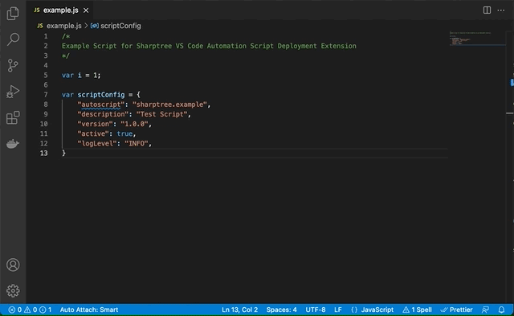

# VS Code Automation Script Deployment Utility

Deploy [Maximo Automation Scripts](https://www.ibm.com/docs/SSLLAM_7.6.0/com.ibm.mbs.doc/autoscript/c_automation_scripts.html) directly to Maximo from Visual Studio Code.

The extension allows developers to describe the automation script through the use of a `scriptConfig` variable and then deploy the script directly to Maximo from Visual Studio Code. The provided `SHARPTREE.AUTOSCRIPT.DEPLOY` automation script provides support for build pipelines and automated deployment of automation scripts from a Git repository. 

# Configuration
## Visual Studio Code Settings
After installation you must provide connection details for your target instance of Maximo. The connection settings are found in the VS Code Settings (`⌘ + ,` or `ctrl + ,`) under the `Maximo` heading. The table below provides a list of the available settings.

| Property      | Description |
| :---          | :----       |
| Allow Untrusted Certs        | When checked, ignores SSL validation rules.|
| Context | The part of the URL that follows the hostname, by default it is `maximo`.|
| Custom CA | The full chain for the server CA in PEM format. |
| Extract Location | Directory where extracted files will be stored.|
| Host | The Maximo host name *without* the http/s protocol prefix. |
| Port | The Maximo port number, 80 for http, 443 for https or your custom port such as 9080.|
| Timeout | The time in seconds to wait for Maximo to respond.|
| User | The user that will be used to connect to Maximo. |
| Use SSL | When checked, SSL will be used, the provided port must be configured for SSL | 

> The Authentication Type setting has been removed and replaced with automatic detection of authentication type.

## Maximo Configuration
The very first time you connect to Maximo, this extension will add several required automation scripts to Maximo. To deploy these scripts, the extension requires that you be in the Maximo Administrators group and have access to the `MXSCRIPT` object structure. To perform the configuration, bring up the Visual Studio Code Command Palette (`View > Command Palette...` or `⌘ + shift + p` or `ctrl + shift + p`) and select `Deploy Automation Script`. You will be prompted for a password and then a dialog will be displayed prompting you to configure Maximo.


Click the `Yes` button to proceed. The configuration should take less than a minute and a progress indicator will be displayed in the bottom right of the screen.


Upon completion a dialog will be displayed confirming the configuration was successful.


The extension is now ready to deploy automation scripts. This process is only for the initial configuration. After the initial configuration, any user that is in the Maximo Administrators group or has been granted the `Deploy Automation Script` permission under the `SHARPTREE_UTILS` object structure as shown below.


### Maximo Configuration Details
As part of the configuration, an integration object named `SHARPTREE_UTILS` is created and the automation scripts listed below are also created.

| Script        | Description |
| :---          | :----       |
| SHARPTREE.AUTOSCRIPT.DEPLOY | The primary script used for deploying and managing automation scripts. |
| SHARPTREE.AUTOSCRIPT.DEPLOY.HISTORY | Created after the first script is deployed. Contains a JSON with a history of all scripts deployed. |
| SHARPTREE.AUTOSCRIPT.FILBERT | Script for parsing Python scripts to a abstract structure tree (AST) to extract the embedded configuration JSON. |
| SHARPTREE.AUTOSCRIPT.STORE | Script for managing the storage of the deploy history. |
| SHARPTREE.AUTOSCRIPT.EXTRACT | Script for extracting scripts from Maximo. |

## scriptConfig Variable
Each script must define a variable named `scriptConfig` that is a JSON object describing how to deploy the script. The extension uses these values to populate the corresponding values of the `AUTOSCRIPT` and `SCRIPTLAUNCHPOINT` Maximo Business Obejcts. At a minimum the `autoscript` attribute is required, all other attributes are optional.  All configuration attributes are available and are defined by their label name without spaces, in camel case.  The example below provides the basic structure.

All value names within the `scriptConfig` map to the application label, without spaces and in camel case. For example if the label in the application is `Before Save` the corresponding value name is `beforeSave`.

An `onDeploy` property can be defined with a value specifying the name of a function in the deployed script that will be called when the script is deployed.  This provides the opportunity to perform configurations in addition to the standard script configurations. Two global variables are provided, the `service` variable, which is the standard the standard com.ibm.tivoli.maximo.script.Service class and the `onDeploy` variable, which is a `boolean` value that indicates that the `onDeploy` function is being invoked.  To execute the `onDeploy` function, the whole script must be evaluated and the `onDeploy` variable allows skipping execution during this evaluation.

> Maximo requires that JavaScript objects have quoted properties, as shown below.  If you are using Prettier as your code formatter it may automatically remove these quotes, which will result in errors when deploying.  To retain the quotes go to the Visual Studio Code Settings (`⌘ + ,` or `ctrl + ,`), select `Prettier`, then find the `Quote Props` setting and select the `preserve` option.  
> 
> 

### JavaScript / Nashorn Example
```javascript
main();

function main(){
    // entry point for the script.
}

var scriptConfig = {
    "autoscript":"EXAMPLE_SCRIPT",
    "description":"An example script for deployment",
    "version":"1.0.4",
    "active":true,
    "logLevel":"INFO",
    "autoScriptVars":[
        {
            "varname":"examplevar",
            "description":"An example variable"
        }
    ],
    "scriptLaunchPoints":[
        {
            "launchPointName":"EXAMPLELP",
            "launchPointType":"OBJECT",
            "description":"An example launch point for Labor",
            "objectName":"LABOR",
            "save":true,
            "add":true,
            "update":true,
            "beforeSave":true,
            "launchPointVars":[
                {
                "varName":"examplevar",
                "varBindingValue":"Example binding"
                }
            ]
        }
    ],
}

```

### Python / Jython

For Python / Jython scripts the same JSON script configuration is used, just triple quote it as a `string` value.

```python

def main():
    # entry point for the script.

main()    

scriptConfig = """{
    "autoscript":"EXAMPLE_SCRIPT",
    "description":"An example script for deployment",
    "version":"1.0.4",
    "active":true,
    "logLevel":"INFO",
    "autoScriptVars":[
        {
            "varname":"examplevar",
            "description":"An example variable"
        }
    ],
    "scriptLaunchPoints":[
        {
            "launchPointName":"EXAMPLELP",
            "launchPointType":"OBJECT",
            "description":"An example launch point for Labor",
            "objectName":"LABOR",
            "save":true,
            "add":true,
            "update":true,
            "beforeSave":true,
            "launchPointVars":[
                {
                "varName":"examplevar",
                "varBindingValue":"Example binding"
                }
            ]
        }
    ],
}"""

```

## Deploy Automation Script
To deploy a script, open script in Visual Studio Code, then bring up the Visual Studio Code Command Palette (`View > Command Palette...` or `⌘ + shift + p` or `ctrl + shift + p`) and select `Deploy Automation Script`. If this is the first time deploying a script after starting Visual Studio Code you will be prompted for your Maximo password as this extension does not store passwords. The script is then deployed as can be seen below.


After the script has been deployed you can view the script in Maximo. Each deployment replaces the script launch point configuration with the configuration defined in the `scriptConfig` JSON.


## Extract Automation Scripts
To extract the scripts currently deployed to Maximo, bring up the Visual Studio Code Command Palette (`View > Command Palette...` or `⌘ + shift + p` or `ctrl + shift + p`) and select `Extract Automation Scripts`. The extension will query Maximo for the available scripts and then prompt for confirmation to extract the scripts as shown below. Scripts are saved to the directory specified in the `Extract Location` setting. If the setting has not been configured, the scripts are extracted to the current workspace folder.



## Requirements

- Maximo 7.6.0.8 or higher, Maximo Application Suite 8 is supported.
- Files must have a `.js` or `.py` extension.
- This extension requires Maximo to support Nashorn scripts, which requires Maximo to be running on Java 8.
- Initial configuration must be done by a user in the administrative group defined by `ADMINGROUP` `MAXVARS` entry.  Typically this is `MAXADMIN`.

## Release Notes
### 1.0.22
- Add feature for defining an `onDeploy` function that will be called when the script is deployed.

### 1.0.21
- Fixed error when extracting scripts with spaces in the name.

### 1.0.20
- Documentation update.
  
### 1.0.19
- Documentation updates.
- Prettier configuration details for preserving property quotes.
  
### 1.0.18
- Replaced Authentication Type setting with automatic detection of the authentication type.
  
### 1.0.16/17
- Fixed formatting of the Automation Scripts table.
- Fixed untrusted SSL handling.
- Added custom CA setting and handling.

### 1.0.15 
- Documentation fixes.  

### 1.0.14
- Documentation updates and build pipeline testing.

### 1.0.13
- Documentation updates.
  
### 1.0.12
- MAS 8 with OIDC login support.
- Fixes for Form based login.
  
### 1.0.11
- Updated documentation with Python / Jython example.
  
### 1.0.10
- Fixed Windows path handling.

### 1.0.9
- Fixed paging size
- Fixed extract script naming issue.
  
### 1.0.8
- Moved the version dependency back to 1.46.

### 1.0.7
- Added extract script functionality.

### 1.0.6

- Fixed checks for attribute launch points.
- Added setting for network timeout.
- Fixed try / catch / finally Python parsing support.
  
### 1.0.4

- Added Python support.
- Added deployment tracking.
  
### 1.0.3

- Added context support.
- Added automatic upgrade path support.

### 1.0.2

- Removed check for Java version due to permission issues checking Maximo JVM information.

### 1.0.1

- Add checks for supported versions of Maximo and Java.
- Improve deployment progress feedback.
- Fixed compatibility issue with Maximo versions prior to 7.6.1.2.

### 1.0.0

- Initial release of the Sharptree VS Code Automation Script Deployment Utility.